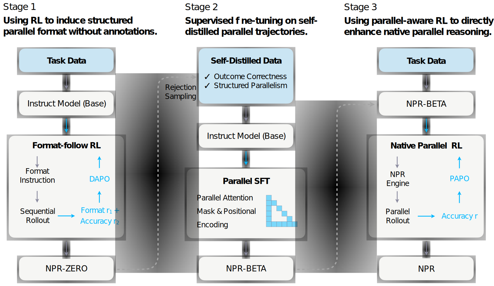

<div align="center">

# Native Parallel Reasoner: Reasoning in Parallelism via Self-Distilled Reinforcement Learning

[](https://arxiv.org/abs/xxxx.xxxxx)    [](https://bigai-nlco.github.io/Native-Parallel-Reasoner/)    [](https://github.com/bigai-nlco/Native-Parallel-Reasoner)    [](https://huggingface.co/bigai-NPR/models)


</div>

## Table of Contents
- [Overview](#overview)
- [Getting Started](#getting-started)
  - [Stage 1: NPR-Zero](#stage-1-npr-zero)
  - [Stage 2: NPR-Beta](#stage-2-npr-beta)
  - [Stage 3: NPR](#stage-3-npr)
  - [Evaluations](#evaluations)
- [Contributing](#contributing)
- [License](#license)
- [Citation](#citation)
- [Acknowledgment](#acknowledgment)

## Overview
We introduce the Native Parallel Reasoner (NPR), a scalable framework for constructing models that intrinsically reason in parallelism. NPR learns adaptive decomposition and aggregation policies through a teacher-free pipeline combining self-distilled parallel Supervised Fine-Tuning (SFT) with Native Parallel Reinforcement Learning (RL). This approach allows the model to optimize its own branching strategies directly from experience within a shared computation graph, preserving its native reasoning style while maximizing exploration efficiency. Across eight diverse reasoning benchmarks, NPR achieves decisive gains: self-distilled data outperform prior teacher-generated corpora by 10.1%, and our Parallel RL stage improves over direct RL baselines by 3.0%. Crucially, NPR delivers up to 4.6× inference acceleration over autoregressive baselines and exhibits genuine, non-simulated parallel reasoning behaviors. 



## Getting Started
### Stage 1: NPR-Zero

#### How to Install
```
# Create env for NPR-Zero
cd npr-zero
conda create -n zero python=3.11
conda activate zero
conda install nvidia::cuda-nvcc

# Install dependencies
pip install -e .[sglang]
pip install liger-kernel
pip install https://github.com/Dao-AILab/flash-attention/releases/download/v2.7.4.post1/flash_attn-2.7.4.post1+cu12torch2.6cxx11abiFALSE-cp311-cp311-linux_x86_64.whl
pip uninstall pynvml
pip install "latex2sympy2-extended[antlr4_9_3]"
```

#### Prepare Datasets and Model
1. Download the training dataset **ORZ** from [huggingface](https://huggingface.co/datasets/Open-Reasoner-Zero/orz_math_57k_collection) to `experiments/raw_data` folder.
2. `python examples/data_preprocess/orz.py`
3. `python examples/data_preprocess/aime25.py`
4. Download the model **Qwen3-4B-Instruct-2507** from [huggingface](https://huggingface.co/Qwen/Qwen3-4B-Instruct-2507).

#### Training Scripts
Modify the `RAY_DATA_HOME` and `MODEL_PATH` to yours.
```
# Run NPR-Zero training
bash experiments/run.sh
```

### Stage 2: NPR-Beta

#### How to Install
```
# Create env for NPR-Beta
cd npr-Beta
conda create -n warmup python=3.11 -y
conda activate warmup

# Install dependencies
pip install -r requirements.txt
```

#### Prepare Datasets and Model
```
# Perform rejection sampling
bash scripts/sampling.sh
```
Key parameters in `sampling.sh`:
- `MODEL_PATH`: Path to model checkpoint (Stage 1)
- `OUTPUT_DIR`: Output directory for sampled trajectories
- `--dataset`: Dataset name (default: ORZ-MATH-57K)
- `--instruction`: Prompt template file
- `--max_sample_trial`: Max sampling attempts per problem (default: 8)
- `--temperature`: Sampling temperature (default: 1.0)

#### Training Scripts
```
# Start warmup training
bash train/sft_math.sh
```
Key parameters in `sft_math.sh`:
- `base_model`: Base model to fine-tune (default: Qwen3-4B-Instruct)
- `train_file_path`: Training trajectories path (default: `dataset/math/rejection_sampling/train`)
- `lr`: Learning rate
- `epochs`: Number of training epochs
- Output checkpoints saved to `ckpts/NPR-Warmup-4B-Inst-{timestamp}/`

### Stage 3: NPR

#### How to Install
```
# Create env for NPR-RL
cd npr-rl
conda create -n rl python=3.11
conda activate rl
conda install nvidia::cuda-nvcc

# Install dependencies
pip install -e .
pip install liger-kernel
pip uninstall pynvml
pip install "latex2sympy2-extended[antlr4_9_3]"
cd verl/workers/rollout/sglang_rollout/sglang/python
pip install -e .
pip install https://github.com/Dao-AILab/flash-attention/releases/download/v2.7.4.post1/flash_attn-2.7.4.post1+cu12torch2.6cxx11abiFALSE-cp311-cp311-linux_x86_64.whl
pip install fire
```

#### Prepare Datasets and Model
1. Download the training dataset **ORZ** from [huggingface](https://huggingface.co/datasets/Open-Reasoner-Zero/orz_math_57k_collection) to `experiments/raw_data` folder.
2. `python examples/data_preprocess/orz.py` 
3. `python examples/data_preprocess/aime.py` 

#### Training Scripts
Modify the `RAY_DATA_HOME` and `MODEL_PATH` to yours.

Note the `MODEL_PATH` is from Stage 2.
```
# Run native parallel RL
bash experiments/run.sh
```

### Evaluations

#### How to Install
```
# Create env for evaluations
cd evals
conda create -n eval python=3.10
conda activate eval

# Install dependencies
pip install -r requirements.txt
```

#### Prepare Datasets and Model
1. `python convert_to_hf.py verl/experiments/ckpts/project_name/exp_name/global_step_x/actor <STAGE_2_MODEL_PATH> <TARGET_HF_MODEL_PATH>`
2. Or download NPR-4B from [Huggingface](https://huggingface.co/bigai-NPR/NPR-4B).

#### Scripts
Modify the `<<TARGET_HF_MODEL_PATH>>` to yours.
```
# Start evaluation of AIME25
./scripts/eval.sh \
    --cuda 0,1,2,3,4,5,6,7 \
    --tp_size 2 \
    --dp_size 4 \
    --task "AIME25" \
    --max_eval_samples 30 \
    --eval_batch_size 8 \
    --model_path <TARGET_HF_MODEL_PATH> \
    --prompt_path prompts/npr.txt \
    --engine parallel \
    --num_samples 1 \
    --k 1 \
    --max_new_tokens 40000 \
    --temperature 1.0 \
    --top_p 0.7 \
    --top_k -1 \
    --overwrite \
    --apply_chat
```

#### Official Results of NPR
We report Pass@1 accuracy averaged over 8 samples for each problem as below.


## Contributing

- **[Join the Discussions](https://github.com/bigai-nlco/Native-Parallel-Reasoner/issues)**: Share your insights, provide feedback, or ask questions.
- **[Report Issues](https://github.com/bigai-nlco/Native-Parallel-Reasoner/issues)**: Submit bugs found or log feature requests for the `Native-Parallel-Reasoner` project.
- **[Submit Pull Requests](https://github.com/bigai-nlco/Native-Parallel-Reasoner/pulls)**: Review open PRs, and submit your own PRs.

<details closed>
<summary>Contributing Guidelines</summary>

1. **Fork the Repository**: Start by forking the project repository to your local host.
2. **Clone Locally**: Clone the forked repository to your local machine using a git client.
   ```bash
   git clone https://github.com/bigai-nlco/Native-Parallel-Reasoner.git 
   ```
3. **Create a New Branch**: Always work on a new branch, giving it a descriptive name.
   ```bash
   git checkout -b your_name/feature-x
   CE```
4. **Make Your Changes**: Develop and test your changes locally.
5. **Commit Your Changes**: Commit with a clear message describing your updates.
   ```sh
   git commit -m 'Implemented new feature x.'
   ```
6. **Push to local**: Push the changes to your forked repository.
   ```sh
   git push origin feature-x
   ```
7. **Submit a Pull Request**: Create a PR against the original project repository. Clearly describe the changes and their motivations.
8. **Review**: Once your PR is reviewed and approved, it will be merged into the main branch. Congratulations on your contribution!
</details>

## License

Native Parallel Reasoner is protected under the [LICENSE](https://choosealicense.com/licenses/mit). For more details, please refer to the [LICENSE](LICENSE) file.

## Citation
```bibtex
@misc{bigai2025nativeparallelreasoner,
      title={Native Parallel Reasoner: Reasoning in Parallelism via Self-Distilled Reinforcement Learning}, 
      author={Tong Wu and Yang Liu and Jun Bai and Zixia Jia and Shuyi Zhang and Ziyong Lin and Yanting Wang and Song-Chun Zhu and Zilong Zheng},
      year={2025},
      url={https://github.com/bigai-nlco/Native-Parallel-Reasoner/blob/main/pdf/Native-Parallel-Reasoner.pdf},
}
```

## Acknowledgment
This codebase is influenced by these remarkable projects of AI community, including [verl](https://github.com/volcengine/verl?tab=readme-ov-file), [sglang](https://github.com/sgl-project/sglang), and [Multiverse](https://github.com/Infini-AI-Lab/Multiverse).
